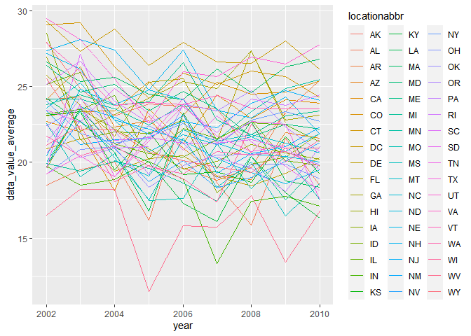

p8105_hw3_msk2265
================
Mirah
2023-10-14

## Problem 1

**First, do some data cleaning:**

**format the data to use appropriate variable names;** - **focus on the
“Overall Health” topic** - **include only responses from “Excellent” to
“Poor”** - **organize responses as a factor taking levels ordered from
“Poor” to “Excellent”**

``` r
#cleaning data

order_vector = c("Poor", "Excellent") #making order for factor variable

brfss_df = brfss_smart2010 %>%
  janitor::clean_names() %>% 
  filter(topic== "Overall Health", response == "Poor" | response == "Excellent") %>% 
  mutate(response = factor(response, levels = order_vector))
  #I can remove several columns to make the data cleaner, but that is not in the instructions so I am not sure if I should be doing that
```

**Using this dataset, do or answer the following (commenting on the
results of each):**

In 2002, which states were observed at 7 or more locations? What about
in 2010?

``` r
#creating a data frame to calculate how many state were observed at 7 or more locations
brfss_df_2002 = brfss_df %>% 
  filter(year == 2002) %>% 
  group_by(locationabbr) %>% #group by state
  summarize(unique_location = n_distinct(locationdesc)) %>% #unique locations in the state
  filter(unique_location > 7) #filter for more than 7 unique locations
count(brfss_df_2002) # counting
```

    ## # A tibble: 1 × 1
    ##       n
    ##   <int>
    ## 1     3

``` r
#same thing for 2010
brfss_df_2010 = brfss_df %>% 
  filter(year == 2010) %>% 
  group_by(locationabbr) %>% #group by state
  summarize(unique_location = n_distinct(locationdesc)) %>% #unique locations in the state
  filter(unique_location > 7) #filter for more than 7 unique locations
count(brfss_df_2010) # counting
```

    ## # A tibble: 1 × 1
    ##       n
    ##   <int>
    ## 1    11

In 2002, there were 3 states that were observed in 7 or more locations,
and in 2010 there were 11 states that were observed in 7 or more unique
locations.

**Construct a dataset that is limited to Excellent responses, and
contains, year, state, and a variable that averages the data_value
across locations within a state. Make a “spaghetti” plot of this average
value over time within a state (that is, make a plot showing a line for
each state across years – the geom_line geometry and group aesthetic
will help).**

``` r
#creating the dataset
brfss_state_averages = brfss_df %>% 
  filter(response == "Excellent") %>% 
  group_by(locationabbr, year) %>% #need to group to calculate mean
  mutate(data_value_average = mean(data_value)) %>% 
  ungroup(locationabbr, year) %>% #ungroup
  select(year, locationabbr, data_value_average) %>% 
  distinct() #getting rid of repeats since each state is listed multiple times
  
#create plot
ggplot(brfss_state_averages, aes(x=year, y= data_value_average, color = locationabbr)) + geom_line()
```

    ## Warning: Removed 3 rows containing missing values (`geom_line()`).

<!-- -->

Make a two-panel plot showing, for the years 2006, and 2010,
distribution of data_value for responses (“Poor” to “Excellent”) among
locations in NY State
